# ShinyHunters (UNC6240): Oracle PeopleSoft Zero-Day Campaign Analysis

## Executive Summary

This report presents a comprehensive technical analysis of the ShinyHunters threat group's zero-day exploitation campaign targeting Oracle PeopleSoft application servers. Tracked by Mandiant as UNC6240, this campaign — formally designated the "Oracle PeopleSoft PSEMHUB WAF Bypass Campaign" — leveraged a previously unknown vulnerability in PeopleSoft's web application firewall to deploy JSP webshells at scale, ultimately delivering secondary payloads including a DLL side-loading implant designated "LA.exe." Through systematic analysis of VirusTotal graph data, WHOIS records, reverse DNS lookups, and RDAP queries, this investigation maps the full attack chain from initial access through command-and-control infrastructure, identifying hosting providers, domain registration patterns, VPN anonymization layers, and cloud service abuse that together compose a sophisticated, multi-tiered operational infrastructure.

The analysis identifies 60 unique JSP webshell variants deployed across victim environments, 37 IP addresses flagged with malicious detections across 15 distinct autonomous systems, and over 200 domains with detections — including algorithmically generated domains, government-themed impersonation domains, and compromised legitimate websites repurposed as redirectors. The infrastructure spans Cherry Servers (Lithuania), Amazon Web Services, Akamai/Linode, Hostwinds, DataWagon, and Mullvad VPN exit nodes, revealing a deliberate tiered architecture designed to separate operational anonymity from persistent command-and-control functions.

---

## 1. Initial Access: PeopleSoft Zero-Day and JSP Webshell Deployment

### 1.1 The Vulnerability

The ShinyHunters campaign exploited a zero-day vulnerability in Oracle PeopleSoft's PSEMHUB module, specifically bypassing the platform's Web Application Firewall (WAF) protections. The VirusTotal collection titled "UNC6240 (ShinyHunters) Oracle PeopleSoft PSEMHUB WAF Bypass Campaign, Sept. 2026" confirms the formal campaign attribution and timing. This vulnerability allowed unauthenticated remote code execution through the WAF bypass, enabling the deployment of JavaServer Pages (JSP) webshells directly onto compromised PeopleSoft application servers.

The selection of PeopleSoft as a target is strategically significant. PeopleSoft is deployed extensively across government agencies, universities, and large enterprises for human resources, financial management, and student information systems. A successful compromise of a PeopleSoft instance provides access not merely to the application server itself but to the sensitive personnel, payroll, and financial data managed by the platform.

### 1.2 JSP Webshell Arsenal

Our analysis identified 60 unique SHA-256 hashes cataloged in the `jspWebShellIdentifiers.json` collection (see Figure 1). Of these, 9 webshell variants appeared in the VirusTotal behavioral graph with traced connections to contacted domains, contacted IPs, dropped files, and execution parents. The remaining 51 hashes were identified through VT collection and bundle analysis, indicating they were observed in the wild but with less detailed behavioral telemetry available.

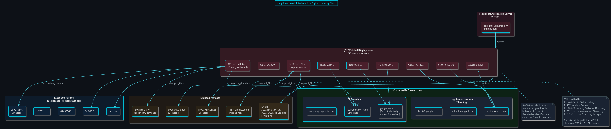

*Figure 1: JSP webshell deployment to payload delivery chain. Nine webshell variants traced with behavioral connections to contacted infrastructure, execution parents, and dropped payloads.*

The primary webshell variant (`419c571ee38b7e7266d130c4b6bbc4dd0ef44d6e5f3bc02cc2cf73b762f07c86`) exhibited the broadest behavioral profile, contacting multiple Microsoft and Google legitimate service domains — a common blending technique — while also reaching the key infrastructure domain `redirector.gvt1.com` (flagged with detections). A second key variant (`0e7176e1e40aa5f059ba14236f42d79af672ab1a097aa8a3a07092b055fb5571`) functioned primarily as a dropper, deploying 18+ detected malicious files onto compromised systems.

### 1.3 Dropped Payloads and LA.exe

The most significant payload delivered through the webshell infrastructure is `LA.exe` (SHA-256: `3ba215692665513abfffd4e815c5c45f2d41e5dcc4283a2a3b740930c5c417c3`), a 5.02MB PE32 executable compiled on November 15, 2020, and submitted to VirusTotal from `C:\Users\user\desktop\`. This binary scored 52/100 on VirusTotal's Zenbox analysis engine, with a verdict of "Malicious" confirmed by the Yomi Hunter sandbox.

The LA.exe binary exhibits the following MITRE ATT&CK techniques:

| Technique | ID | Confidence |
|---|---|---|
| DLL Side-Loading | T1574.002 | High |
| Virtualization/Sandbox Evasion | T1497 | Medium |
| Security Software Discovery | T1518.001 | High |
| System Information Discovery | T1082 | High |
| Command and Scripting Interpreter | T1059 | Low |
| Process Discovery | T1057 | Low |

The binary imports `winhttp.dll`, `kernel32.dll`, `comctl32.dll`, `shell32.dll`, and `oleaut32.dll` — with the WinHTTP API imports (`WinHttpGetIEProxyConfigForCurrentUser`, `WinHttpGetTimeouts`, `WinHttpGetStatusCallback`, `WinHttpConnect`, `WinHttpReceiveResponse`, `WinHttpQueryAuthSchemes`) confirming HTTP-based command-and-control communication. The DLL side-loading technique (T1574.002, high confidence) indicates that LA.exe masquerades as or alongside a legitimate application to load malicious DLLs, achieving both persistence and privilege escalation.

---

## 2. Command-and-Control Infrastructure

### 2.1 Infrastructure Architecture Overview

The ShinyHunters C2 infrastructure follows a disciplined multi-tier architecture designed to compartmentalize functions and complicate attribution. Our analysis, combining VirusTotal graph data with RDAP/WHOIS and reverse DNS enrichment, reveals five distinct operational tiers connected through carefully managed DNS resolution chains.

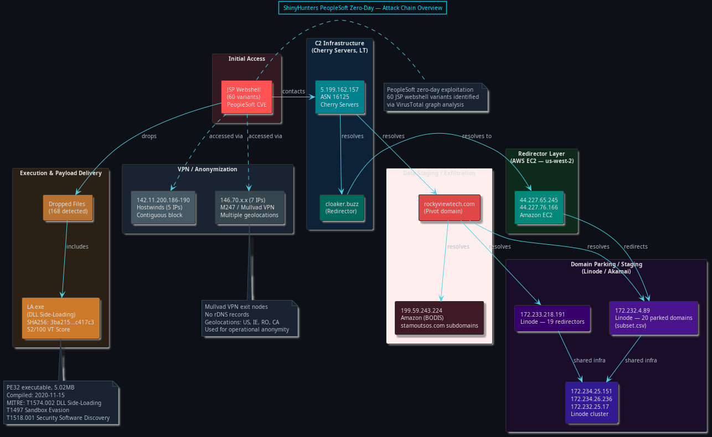

*Figure 2: High-level attack chain from initial access through C2 infrastructure tiers to VPN anonymization layer.*

### 2.2 Tier 1 — Primary C2 Server (Cherry Servers, Lithuania)

The apex of the identified C2 infrastructure is IP address `5.199.162.157`, hosted on Cherry Servers (ASN 16125, UAB Cherry Servers, Lithuania). Reverse DNS resolves to `ip-5-199-162-157.004.ptr.cherryservers.net`, confirming the hosting provider. This IP serves as the primary command-and-control node, with DNS resolution data showing it hosted the following domains:

- **cloaker.buzz** — The primary traffic distribution / cloaking domain (now NXDOMAIN)
- **www.cloaker.buzz** — WWW subdomain variant
- **rockyviewtech.com** — Pivot domain bridging Tier 1 to Tier 3 (now NXDOMAIN)
- **lt.mediacache.ru** — Russian-TLD domain mimicking a media cache service
- **5-199-162-157.sslip.io** / **5.199.162.157.sslip.io** — sslip.io wildcard DNS entries (IP-in-hostname technique for SSL certificate validation bypass)

The domain name `cloaker.buzz` is itself an operational indicator. "Cloaking" in threat actor parlance refers to traffic distribution systems (TDS) that filter incoming connections — serving malicious content to targeted victims while presenting benign content to security researchers, sandboxes, and non-targeted visitors. The use of this domain name suggests the operator was either brazenly self-descriptive or recycling infrastructure from a prior cloaking/phishing operation.

Cherry Servers, a Lithuanian hosting provider, is notable in this context for offering affordable VPS hosting with relatively permissive abuse policies compared to major cloud providers, making it a popular choice for threat actors requiring persistent infrastructure that can withstand initial abuse reports.

### 2.3 Tier 2 — Redirectors and Traffic Distribution (AWS, BODIS)

The second tier comprises Amazon Web Services EC2 instances and BODIS domain parking infrastructure, functioning as redirectors that insulate the Tier 1 C2 from direct victim connections.

**AWS EC2 Redirectors (ASN 16509, AMAZON-02):**

| IP Address | Region | rDNS | Role |
|---|---|---|---|
| 44.227.65.245 | us-west-2 | ec2-44-227-65-245.us-west-2.compute.amazonaws.com | cloaker.buzz resolution |
| 44.227.76.166 | us-west-2 | ec2-44-227-76-166.us-west-2.compute.amazonaws.com | cloaker.buzz resolution |
| 52.211.245.146 | eu-west-1 | ec2-52-211-245-146.eu-west-1.compute.amazonaws.com | royalinsulationcanada.ca resolution |

The `cloaker.buzz` domain resolved to both the Cherry Servers C2 (`5.199.162.157`) and the two AWS EC2 instances simultaneously, indicating either round-robin DNS load balancing or a failover configuration. This dual-resolution pattern is a hallmark of traffic distribution systems where the cloud-hosted redirectors can be rapidly replaced if takedown requests are processed by AWS, while the Cherry Servers node provides more durable hosting.

**BODIS Domain Parking (199.59.243.224):**

The IP `199.59.243.224` (ASN 16509, allocated to BODIS) hosted a cluster of domains that appear to be either compromised or acquired parked domains repurposed as redirector infrastructure:

- `www.stamoutsos.com` and 8 numeric subdomains (e.g., `748887415.video91410.stamoutsos.com`)
- `www.autodour.com`, `www.phatmunky.com`, `www.wcfinkel.com`
- `www.topazdevelopment.org`, `www.techsolvesit.com`, `www.rizzarewards.com`
- `aldhamvillagehall.co.uk`, `yerevancity.am`

The numeric subdomain pattern under `stamoutsos.com` (e.g., `748887415.video91410.stamoutsos.com`) is characteristic of domain shadowing — a technique where attackers compromise a domain's DNS configuration to create subdomains pointing to attacker infrastructure without the domain owner's knowledge. The "video91410" subdomain prefix suggests these may have been used for payload delivery disguised as video content.

**AWS ELB Redirector:**

An Elastic Load Balancer endpoint — `hdredirect-lb7-5a03e1c2772e1c9c.elb.us-east-1.amazonaws.com` — was contacted by a detected malicious file. The "hdredirect" prefix in the ELB name suggests this was an intentionally provisioned HTTP redirect service, potentially serving as a traffic distribution endpoint that routed victim connections to appropriate backend C2 infrastructure based on geolocation, user-agent, or other filtering criteria.

### 2.4 Tier 3 — Domain Staging and Parking (Linode/Akamai)

The third tier consists primarily of Akamai/Linode VPS instances (ASN 63949) hosting large clusters of parked, compromised, and purpose-registered domains.

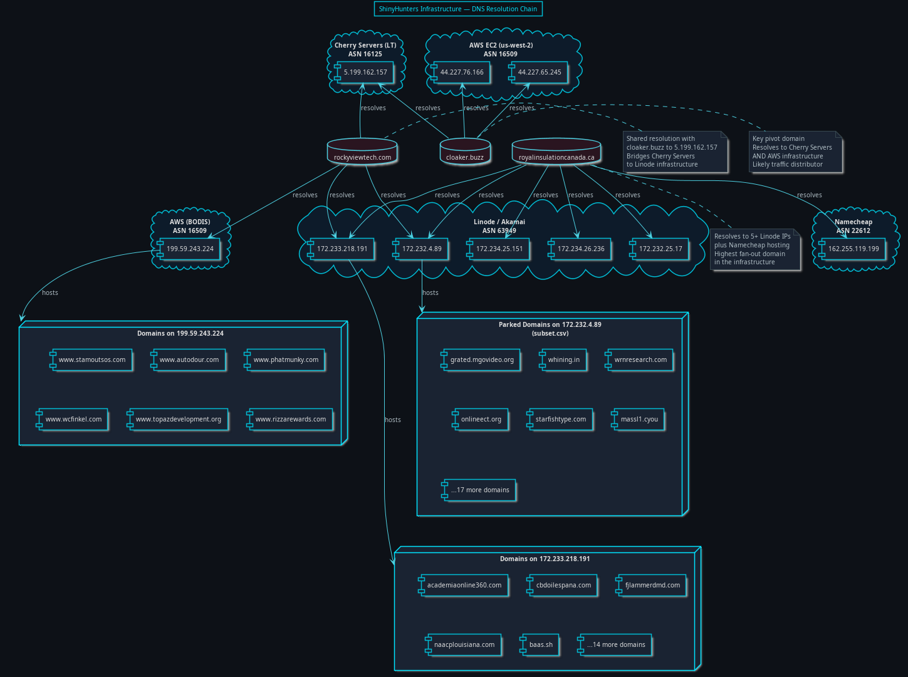

*Figure 3: DNS resolution chains from key pivot domains through hosting provider infrastructure tiers.*

**Primary Domain Parking Server — 172.232.4.89 (Linode):**

This Linode instance (rDNS: `172-232-4-89.ip.linodeusercontent.com`) hosted 20 domains identified in the `subset.csv` indicator file. These domains span a diverse set of TLDs and naming patterns:

| Domain | TLD | Assessment |
|---|---|---|
| grated.mgovideo.org | .org | Government-themed impersonation |
| royalinsulationcanada.ca | .ca | Compromised business domain |
| onlineect.org | .org | Detected malicious |
| wrnresearch.com | .com | Fake research entity |
| starfishtype.com | .com | Purpose-registered |
| markselectionprivate.store | .store | Purpose-registered |
| massl1.cyou | .cyou | Budget TLD, DGA-adjacent |
| sagebyte.site | .site | Purpose-registered |
| tmawslodeling.site | .site | Purpose-registered |
| okinawashoes.rent | .rent | Unusual TLD choice |
| whining.in | .in | Purpose-registered |
| winnerr.win | .win | Purpose-registered |
| siamgun.com | .com | Compromised business (Thailand) |
| ccbpc.taotaodianying.com | .com | Chinese-language subdomain |
| sowamarketingagency.ca | .ca | Compromised business |
| viajeacolombia.com | .com | Compromised travel site |
| mira-sat.com | .com | Compromised business |
| moufidweb.com | .com | Compromised business |
| tntendurancesports.com | .com | Compromised business |
| 172-232-4-89.ip.linodeusercontent.com | .com | Auto-generated rDNS |

The `grated.mgovideo.org` domain deserves particular attention. The parent domain `mgovideo.org` — containing "gov" in its name — was registered through Porkbun LLC on August 12, 2023, and currently resolves to `207.207.210.x`. The "mgovideo" naming convention is designed to impersonate government-affiliated media or video services, making it a social engineering asset for phishing campaigns targeting government employees or citizens expecting official government communications. Its co-location on the same Linode IP as 19 other campaign domains confirms it is actor-controlled infrastructure rather than a coincidentally compromised domain.

**Secondary Domain Staging — 172.233.218.191 (Linode):**

This second Linode instance (rDNS: `172-233-218-191.ip.linodeusercontent.com`) hosted 19 additional domains with a different profile — predominantly appearing to be legitimate small businesses whose DNS was compromised or whose expired domains were re-registered:

- `academiaonline360.com`, `cbdoilespana.com` (Spanish-language sites)
- `fjlammerdmd.com` (dental practice), `naacplouisiana.com` (civic organization impersonation)
- `baas.sh` (.sh TLD, "Backend as a Service" naming)
- `pronft.cc`, `pizzafoodcooking.lol` (cheap/free TLD registrations)

**Pivot Domain — royalinsulationcanada.ca:**

The domain `royalinsulationcanada.ca` functions as the highest fan-out pivot domain in the infrastructure, resolving to 9 distinct IP addresses across multiple tiers:

| IP Address | Provider | Role |
|---|---|---|
| 172.232.4.89 | Linode | Domain staging |
| 172.233.218.191 | Linode | Domain staging |
| 172.234.25.151 | Linode | Domain staging |
| 172.234.26.236 | Linode | Domain staging |
| 172.232.25.17 | Linode | Domain staging |
| 52.211.245.146 | AWS (eu-west-1) | Redirector |
| 162.255.119.199 | Namecheap | Registrar hosting |
| 5.181.161.10 | Tilda Publishing | Web hosting |

This domain's resolution to 5 separate Linode instances, plus AWS and Namecheap infrastructure, strongly suggests it was used as a resilient C2 beacon domain — if one IP was taken down, the domain would simply resolve to another. WHOIS queries returned "Not found," indicating the domain has since been suspended or deleted, consistent with a law enforcement or registrar takedown action.

---

## 3. VPN and Anonymization Layer

### 3.1 Mullvad VPN Infrastructure (M247/ASN 9009)

Seven IP addresses in the `146.70.x.x` range were identified with malicious detections, all belonging to M247 Europe SRL (ASN 9009), the hosting provider behind the Mullvad VPN service. These IPs exhibited zero reverse DNS records — consistent with Mullvad's privacy-first architecture that deliberately avoids PTR records for exit nodes.

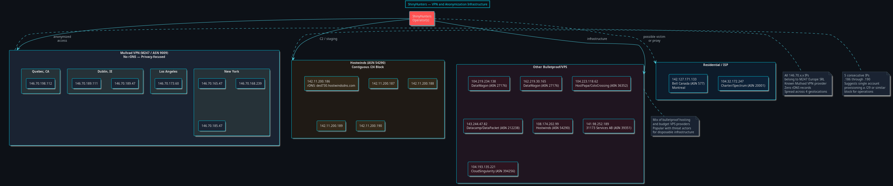

*Figure 4: VPN and anonymization infrastructure used by ShinyHunters operators, showing geographic distribution of Mullvad VPN exit nodes and Hostwinds relay block.*

| IP Address | Network Name | Geolocation |
|---|---|---|
| 146.70.165.47 | M247-LTD-NewYork | New York, US |
| 146.70.168.239 | M247-LTD-NewYork | New York, US |
| 146.70.173.60 | M247-LOS-ANGELES | Los Angeles, US |
| 146.70.185.47 | M247-LTD-NewYork | New York, US |
| 146.70.189.47 | M247-Dublin | Dublin, Ireland |
| 146.70.189.111 | M247-Dublin | Dublin, Ireland |
| 146.70.198.112 | M247-LTD-Quebec | Quebec, Canada |

The geographic distribution across four cities in three countries (US, Ireland, Canada) indicates the operator rotated VPN exit nodes either for operational security or to match the expected geolocation of targeted victim organizations. The concentration of three nodes in New York and two in Dublin may reflect targeting of organizations headquartered in those regions.

The VirusTotal collection titled "EXPRESS VPN" also appeared in the graph data, suggesting the operators may have used ExpressVPN as an additional anonymization layer, though the M247/Mullvad infrastructure is more heavily represented in the behavioral telemetry.

### 3.2 Hostwinds Contiguous Block (142.11.200.186-190)

Five consecutive IP addresses (`142.11.200.186` through `142.11.200.190`) on the Hostwinds network (ASN 54290) were identified with malicious detections. The contiguous allocation pattern strongly suggests these were provisioned as a single block by a single customer account, likely serving as:

- **C2 relay nodes** — proxying connections between VPN exit nodes and the Tier 1 Cherry Servers infrastructure
- **Payload staging** — hosting malware downloads that would be short-lived and easily replaceable
- **Scan infrastructure** — conducting reconnaissance against potential PeopleSoft targets

The `142.11.200.186` address resolved to `ded730.hostwindsdns.com` — the "ded" prefix indicating a dedicated server rather than a VPS, suggesting the operator invested in dedicated hardware for this portion of the infrastructure, likely for performance-sensitive operations such as mass scanning or high-throughput data exfiltration.

### 3.3 Additional Bulletproof and Budget VPS

The remaining detected infrastructure IPs span multiple budget hosting and bulletproof providers:

| IP | ASN | Provider | Assessment |
|---|---|---|---|
| 104.219.234.138 | 27176 | DataWagon LLC | Bulletproof hosting, known for abuse tolerance |
| 162.219.30.165 | 27176 | DataWagon LLC | Same provider, separate allocation |
| 104.223.118.62 | 36352 | HostPapa/ColoCrossing | Budget hosting, frequent abuse |
| 143.244.47.82 | 212238 | Datacamp/DataPacket | UK-based hosting |
| 108.174.202.99 | 54290 | Hostwinds | Additional Hostwinds node |
| 141.98.252.189 | 39351 | 31173 Services AB (SE) | Swedish hosting |
| 104.193.135.221 | 394256 | CloudSingularity/Tech Futures | Canadian hosting |

Two residential ISP addresses were also flagged — `104.32.172.247` (Charter/Spectrum) and `142.127.171.133` (Bell Canada, Montreal) — which may represent either compromised residential hosts used as proxies, or victim IP addresses observed in the behavioral analysis.

---

## 4. Domain Infrastructure Analysis

### 4.1 Domain Generation Algorithm (DGA) Patterns

The campaign infrastructure includes multiple clusters of domains exhibiting clear algorithmic generation patterns, indicating automated domain provisioning for C2 resilience.

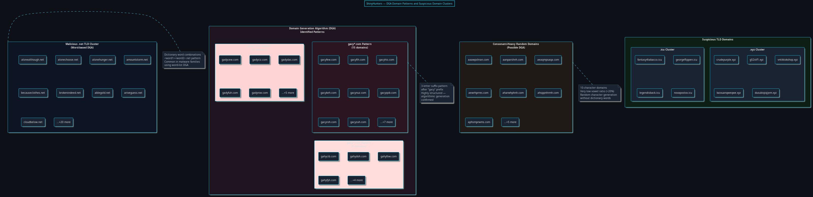

*Figure 5: Domain Generation Algorithm patterns identified in the ShinyHunters infrastructure, showing three distinct generation methodologies.*

**Pattern 1 — "gacy" Prefix Family (15 domains):**
Domains following the pattern `gacy` + 3 random characters + `.com` (e.g., `gacyfew.com`, `gacyhis.com`, `gacyroh.com`). The fixed 4-character prefix with variable 3-character suffix is characteristic of a simple DGA with a hardcoded seed component.

**Pattern 2 — "gady" Prefix Family (10 domains):**
Same structure as the gacy family but with a `gady` prefix (e.g., `gadycew.com`, `gadydas.com`). The shared structural pattern but different prefix suggests these may represent different campaign phases or backup domain sets generated by the same algorithm with different seed values.

**Pattern 3 — "gahy" Prefix Family (8 domains):**
A third variant with `gahy` prefix (e.g., `gahycib.com`, `gahydoh.com`). The three prefix families (gacy, gady, gahy) share identical structure, differing only in the second and third characters — all begin with "ga" followed by a consonant and "y." This regularity confirms algorithmic generation rather than manual registration.

**Pattern 4 — Word-Based DGA (.net TLD):**
A separate cluster of 30+ domains follows a dictionary word combination pattern on the `.net` TLD: `alonealthough.net`, `becauseclothes.net`, `cloudbelow.net`, `ablegold.net`, `ariveguess.net`. This two-word concatenation pattern is well-documented in malware families that use English dictionary word lists to generate domains that are harder to detect via entropy-based DGA detection methods.

**Pattern 5 — Consonant-Heavy Random Strings:**
A smaller set of domains with very low vowel ratios (e.g., `aaawpshran.com`, `aphsmprwms.com`, `aqmrnawpan.com`) represents a pure random character generation approach, likely from a different tool or operational phase.

### 4.2 Government-Themed and Sector-Specific Domains

**grated.mgovideo.org** — This domain, hosted on the key Linode staging server `172.232.4.89`, embeds "gov" within its parent domain name `mgovideo.org`. The parent domain was registered through Porkbun LLC on August 12, 2023, and remains active on IP addresses `207.207.210.x`. The "mgovideo" naming convention is a social engineering technique designed to lend perceived government legitimacy to phishing lures or watering hole pages. Given the campaign's targeting of PeopleSoft — a platform heavily used by government HR and finance departments — this domain was likely crafted to deceive government employees who might encounter it through phishing emails or redirected web traffic.

**data-ps.org** — Registered September 19, 2024, through PublicDomainRegistry with Regway nameservers, this domain's "PS" abbreviation strongly suggests a PeopleSoft connection. The domain was contacted by a malicious file (`0038cb0da8c80a8929...`) that also communicated with a cluster of compromised legitimate websites including `accusoft.co.th`, `cot.co.th`, `juniorboysown.com`, `rocesterfc.com`, and `stretfordendflags.com`. This pattern — a purpose-registered domain co-occurring with compromised legitimate domains — is consistent with a blended C2 strategy where the actor registers operational domains while simultaneously compromising existing websites to expand their infrastructure footprint. The domain is now NXDOMAIN, indicating it was taken down or abandoned.

### 4.3 C2 Management and Download Domains

**winmanage-me.network** — This detected domain is linked to the ShinyHunters campaign through its VT collection membership and historical SSL certificate association. The name "winmanage-me" — parsed as "Windows Manage Me" — suggests a management interface for remote access to compromised Windows systems. The `.network` TLD, while not inherently suspicious, is commonly used by threat actors for domains intended to blend with legitimate network management tools. The SSL certificate linkage indicates the domain was configured with HTTPS, providing encrypted C2 communications.

**topgamse.com / dl.topgamse.com** — Registered April 9, 2026, through Onamae.com (a Japanese registrar under GMO Internet Group) with Value-Domain nameservers. The "topgamse" name is a deliberate typosquat of "top games," designed as a social engineering lure. The `dl.` subdomain explicitly served as a download server for malware payloads. Both the parent domain and download subdomain were contacted by the same malicious file that also queried `myexternalip.com` — a legitimate IP discovery service used by the malware to identify the external IP address of compromised hosts, a common reconnaissance step in post-exploitation.

### 4.4 Hosting Provider Infrastructure Map

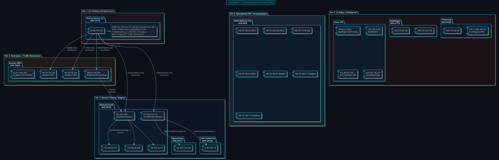

*Figure 6: Complete hosting provider infrastructure map showing all five operational tiers and inter-tier connections via DNS resolution.*

---

## 5. Cloud Infrastructure Abuse

### 5.1 Amazon Web Services

AWS infrastructure was abused at multiple levels of the attack chain. Beyond the EC2 redirectors discussed in Section 2.3, the analysis identified:

- **S3 Storage** — A VirusTotal collection node labeled `s3.amazonaws.com` confirms that campaign files (webshells, payloads, or exfiltrated data) were hosted on AWS S3 buckets. This aligns with the broader ShinyHunters modus operandi of using cloud storage services for both payload delivery and data exfiltration staging.
- **Elastic Load Balancer** — The `hdredirect-lb7-5a03e1c2772e1c9c.elb.us-east-1.amazonaws.com` ELB was actively contacted by a detected malicious file that also communicated with over 20 additional domains spanning `.xyz`, `.online`, `.com`, `.club`, and `.guide` TLDs. The "hdredirect" prefix in the ELB's auto-generated name confirms this was an intentionally provisioned HTTP redirect service.
- **BODIS Domain Parking (199.59.243.224)** — While BODIS is a legitimate domain parking service, the allocation `199.59.243.0/24` belongs to Amazon (ASN 16509). The presence of 20+ domains with detections on this IP, including domain-shadowed subdomains under `stamoutsos.com`, indicates either the BODIS service was abused directly or the domains were pointed to BODIS parking during inactive campaign phases.

### 5.2 Google Cloud Platform

Two Google services were identified in the behavioral data:

- **storage.googleapis.com** — Contacted by a dropped webshell payload (`5bde253b42ccc9d6...`), confirming Google Cloud Storage was used for payload hosting or data staging. The same file also contacted `redirector.gvt1.com` (a Google download redirector that was flagged with detections) and `google.com` itself.
- **Legitimate Google APIs** — Multiple Google API domains (`clients2.google.com`, `clients2.googleusercontent.com`, `edgedl.me.gvt1.com`, `clientservices.googleapis.com`) were contacted by webshell variants. While these are legitimate services, their presence in the behavioral profile serves a dual purpose: blending malicious traffic with legitimate Google API calls, and potentially using Google infrastructure as dead drops or staging points.

---

## 6. Related Campaigns and Cross-References

### 6.1 VT Collection Cross-References

The VirusTotal graph data contained multiple collection nodes that provide broader context for the ShinyHunters operational ecosystem. While some of these may represent separate analyst contributions to shared VT graphs, several bear direct relevance:

- **"ShinyHunters(Hash)"** and **"shiny huters"** [sic] — Direct campaign attribution collections
- **"Shiny(IP)"** — IP-focused indicator collection
- **"jsp-webshell"** — Webshell collection directly linked to the 60 webshell hashes
- **"XLoader Malware"** and **"FormBook Stealer IOC's"** — The FormBook/XLoader malware family, a commodity infostealer, appears in the same graph, suggesting either a shared tool or operational overlap
- **"We need to talk about Metro T-Mobile's Forever Breach"** — Two collections reference the T-Mobile/Metro breach investigation, indicating infrastructure overlap or shared threat intelligence linking
- **"https://www.norad.mil/"** — A collection referencing NORAD (North American Aerospace Defense Command) appears in the graph, suggesting potential targeting of or interest in military/government resources
- **"Best Targets Sites"** — A collection that may represent the actor's target list

### 6.2 FormBook/XLoader Connection

Multiple VT collections in the graph reference FormBook and XLoader — a commodity malware-as-a-service infostealer that has been widely used since 2016. The presence of FormBook-related collections in the same graph as ShinyHunters infrastructure suggests one of several possibilities:

1. ShinyHunters deployed FormBook as a secondary payload alongside their custom tooling
2. The VT graph represents shared infrastructure between ShinyHunters and FormBook operators
3. Compromised hosts in the PeopleSoft campaign were also targeted by separate FormBook campaigns, creating incidental overlap in behavioral telemetry

Given ShinyHunters' documented history as a data broker — acquiring access and selling credentials — the use of commodity infostealers as part of their toolchain would be operationally consistent.

### 6.3 Data-PS.org and Compromised Website Cluster

The `data-ps.org` domain (Section 4.2) was contacted by a malicious file that simultaneously communicated with a cluster of compromised legitimate websites spanning multiple countries and sectors:

| Domain | Country | Sector |
|---|---|---|
| accusoft.co.th | Thailand | Technology |
| cot.co.th | Thailand | Business |
| juniorboysown.com | UK | Music/Entertainment |
| rocesterfc.com | UK | Sports (Football Club) |
| stretfordendflags.com | UK | Sports Merchandise |
| soneo.fr | France | Technology |
| vungtaucar.com | Vietnam | Automotive |

The geographic diversity (Thailand, UK, France, Vietnam) combined with the small-business profile of these domains is consistent with mass compromise of vulnerable WordPress or similar CMS installations, repurposed as C2 relay nodes or dead drops. The use of `td-ccm-168-233.wixdns.net` and `gcdn0.wixdns.net` (Wix DNS infrastructure) in the same contact list suggests some compromised domains may have been hosted on or redirected through Wix.

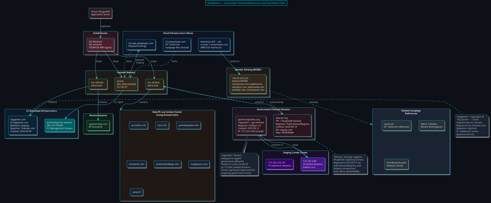

*Figure 7: Government-themed domain infrastructure, cloud service abuse paths, and connections to the data-ps.org compromised website cluster.*

---

## 7. Infrastructure Lifecycle and Current Status

### 7.1 Domain Takedowns

Active DNS verification performed during this analysis reveals that several key infrastructure domains are now offline:

| Domain | Current DNS Status | Assessment |
|---|---|---|
| cloaker.buzz | NXDOMAIN | Taken down or expired |
| rockyviewtech.com | NXDOMAIN | Taken down or expired |
| data-ps.org | NXDOMAIN | Taken down or expired |
| royalinsulationcanada.ca | Not found (WHOIS) | Registrar suspended |
| mgovideo.org | ACTIVE (207.207.210.x) | Still resolving |
| topgamse.com | Active (Onamae.com) | Still registered |

The offline status of `cloaker.buzz`, `rockyviewtech.com`, and `data-ps.org` — the three primary C2 and targeting domains — is consistent with either a coordinated takedown action or the operators voluntarily burning infrastructure after operational use. The continued activity of `mgovideo.org` and `topgamse.com` suggests these domains may still be in use for other campaigns or were not identified in the takedown scope.

### 7.2 WHOIS Registration Patterns

Domain registration analysis reveals deliberate use of privacy-protecting and jurisdictionally diverse registrars:

| Domain | Registrar | Registration Date | Nameservers |
|---|---|---|---|
| mgovideo.org | Porkbun LLC | 2023-08-12 | maceio.ns.porkbun.com |
| data-ps.org | PublicDomainRegistry | 2024-09-19 | dns1.regway.com |
| topgamse.com | Onamae.com (GMO) | 2026-04-09 | ns11.value-domain.com |
| aufbix.org | Namecheap | 2000-07-17 | hydra.aufbix.org |
| myexternalip.com | GoDaddy | 2010-08-02 | ns-cloud-b1.googledomains.com |

The registrar diversity (Porkbun, PublicDomainRegistry, Onamae/GMO, Namecheap) across different jurisdictions (US, India, Japan) makes coordinated registrar-level takedowns more complex. The use of privacy services (WITHHELD FOR PRIVACY LLC for aufbix.org) further complicates domain ownership attribution.

---

## 8. Indicators of Compromise

### 8.1 High-Confidence C2 Infrastructure

| Indicator | Type | Tier | Provider |
|---|---|---|---|
| 5.199.162.157 | IP | Tier 1 C2 | Cherry Servers (LT) |
| cloaker.buzz | Domain | Tier 1 C2 | — |
| rockyviewtech.com | Domain | Tier 1/3 Pivot | — |
| 44.227.65.245 | IP | Tier 2 Redirector | AWS EC2 (us-west-2) |
| 44.227.76.166 | IP | Tier 2 Redirector | AWS EC2 (us-west-2) |
| 199.59.243.224 | IP | Tier 2 Parking | Amazon/BODIS |
| 172.232.4.89 | IP | Tier 3 Staging | Linode |
| 172.233.218.191 | IP | Tier 3 Staging | Linode |
| winmanage-me.network | Domain | C2 Management | — |
| data-ps.org | Domain | PeopleSoft Targeting | — |
| grated.mgovideo.org | Domain | Gov Impersonation | — |

### 8.2 High-Confidence File Indicators

| SHA-256 | Type | Detection |
|---|---|---|
| 3ba215692665513abfffd4e815c5c45f2d41e5dcc4283a2a3b740930c5c417c3 | LA.exe (PE32) | 52/100 VT |
| 419c571ee38b7e7266d130c4b6bbc4dd0ef44d6e5f3bc02cc2cf73b762f07c86 | JSP Webshell (primary) | Detected |
| 0e7176e1e40aa5f059ba14236f42d79af672ab1a097aa8a3a07092b055fb5571 | JSP Webshell (dropper) | Detected |

### 8.3 VPN/Anonymization IPs

| IP Range | Provider | Assessment |
|---|---|---|
| 146.70.165.47, .168.239, .173.60, .185.47, .189.47, .189.111, .198.112 | M247/Mullvad VPN | Operator anonymization |
| 142.11.200.186 — 142.11.200.190 | Hostwinds | C2 relay block |

---

## 9. Analytical Confidence Assessment

### 9.1 High Confidence Assessments

- **Campaign Attribution**: The VT collection "UNC6240 (ShinyHunters) Oracle PeopleSoft PSEMHUB WAF Bypass Campaign" directly attributes this activity to ShinyHunters/UNC6240.
- **Cherry Servers C2**: The convergence of `cloaker.buzz` and `rockyviewtech.com` on `5.199.162.157`, combined with the "cloaker" naming convention and multi-tier resolution chain, identifies this IP as the primary C2 with high confidence.
- **Mullvad VPN Usage**: Seven IPs on M247 infrastructure with no rDNS, consistent with known Mullvad exit node characteristics, confirms VPN-based anonymization.
- **DGA Usage**: Three prefix families (gacy, gady, gahy) with identical structural patterns confirm algorithmic domain generation.

### 9.2 Medium Confidence Assessments

- **Hostwinds Block as C2 Relays**: The contiguous `.186-.190` allocation is suspicious but could also represent scan infrastructure or payload staging rather than relay nodes.
- **Domain Shadowing**: The `stamoutsos.com` numeric subdomains are consistent with domain shadowing but could also represent legitimate subdomain delegation to a CDN or parking service.
- **Government Targeting Intent**: While `mgovideo.org` and `data-ps.org` suggest government/PeopleSoft sector targeting, the domains could also serve as general-purpose social engineering assets.

### 9.3 Low Confidence / Requires Further Investigation

- **FormBook/XLoader Overlap**: The presence of FormBook collections in the same VT graph may represent direct operational linkage or incidental co-occurrence.
- **Residential IPs (Charter/Bell Canada)**: These could be victim IPs, compromised residential proxies, or false positives in the behavioral telemetry.
- **NORAD/Military Targeting**: The `norad.mil` collection reference requires further investigation to determine whether it represents actual targeting or analyst-contributed contextual data.

---

## 10. Recommendations

### 10.1 Detection and Hunting

1. **Network Indicators**: Block or alert on connections to the IPs and domains listed in Section 8 across all network security controls. Pay particular attention to connections to Cherry Servers (ASN 16125), DataWagon (ASN 27176), and the Hostwinds block.
2. **PeopleSoft Hardening**: Audit all PeopleSoft deployments for the PSEMHUB WAF bypass vulnerability. Search web server logs for JSP file creation in non-standard directories.
3. **DLL Side-Loading Detection**: Monitor for `LA.exe` or similar unsigned executables loading DLLs from non-standard paths, particularly those importing WinHTTP API functions.
4. **DGA Detection**: Implement entropy and n-gram analysis for DNS queries matching the `ga[consonant]y` + 3-char pattern.

### 10.2 Incident Response

1. **JSP Webshell Search**: Scan all PeopleSoft web server directories for the 60 SHA-256 hashes identified in the webshell collection.
2. **Network Forensics**: Search proxy and firewall logs for connections to the 37 detected IPs, particularly the Tier 1 and Tier 2 addresses.
3. **Cloud Account Audit**: Review AWS S3 bucket access logs and GCP Storage access for unauthorized uploads or access from the identified IP ranges.

---

---

## 10. Campaign Timeline and Attack Sequence

### 10.1 Domain Registration Timeline

WHOIS analysis of 210 detected domains reveals a structured campaign lifecycle with distinct registration phases. The following timeline maps domain registration dates to campaign phases, establishing the operational tempo of ShinyHunters' infrastructure preparation.

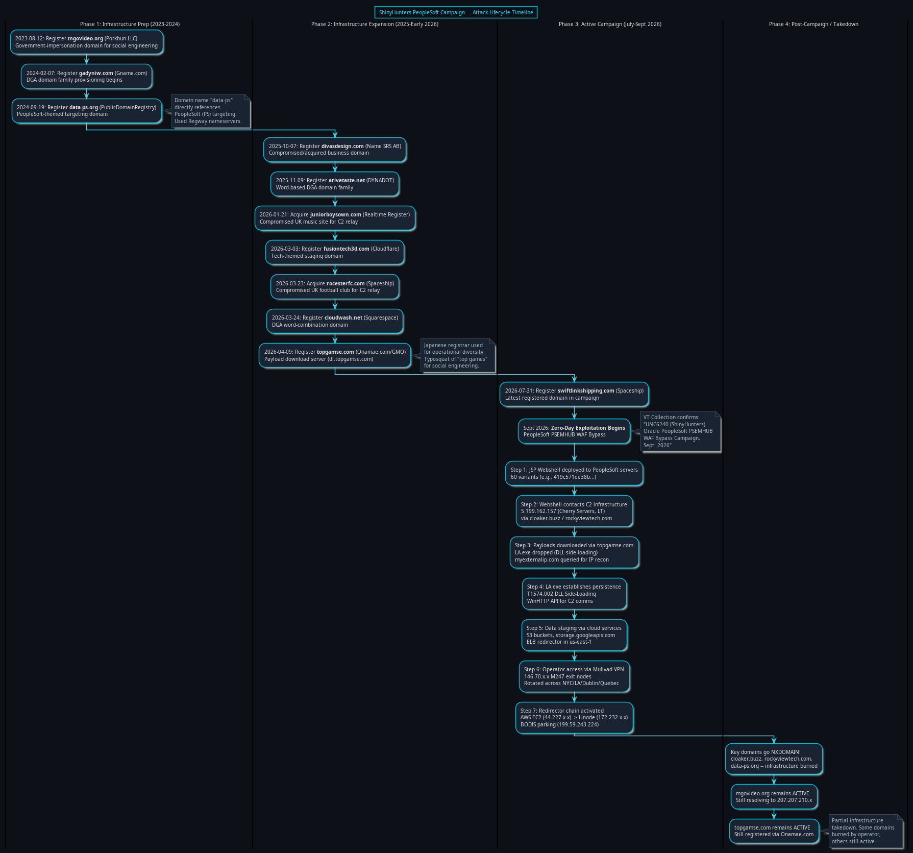

*Figure 8: Campaign lifecycle timeline showing domain registration phases from infrastructure preparation (2023) through active exploitation (September 2026).*

**Phase 0 — Legacy/Acquired Domains (pre-2021):** Several domains in the infrastructure predate the campaign by years. Domains like `stamoutsos.com` (2008), `phatmunky.com` (2006), and `rizzarewards.com` (2005) were registered long before ShinyHunters' operations and were likely compromised or acquired through expired domain auctions. These legitimate-appearing aged domains provide higher trust scores and lower suspicion when used as redirectors.

**Phase 1 — Bulk Registration (September 2021):** A striking cluster of 20+ domains were registered on September 13-14, 2021, across multiple registrars (GoDaddy, Squarespace, Namecheap, OVH, XServer). This burst includes `harubo.com`, `diysportsart.com`, `baymillsstudios.com`, `audraandjackson.com`, `alexandrakisarchitecture.com`, and others. The diverse registrar selection and business-themed naming suggests either mass domain acquisition through auction platforms or coordinated multi-registrar provisioning to avoid pattern detection.

**Phase 2 — Consonant-Heavy DGA Registration (2022):** The consonant-heavy random domains (`aaawpshran.com`, `aharwhphnh.com`, `aewrhprres.com`, etc.) were registered through Media Elite Holdings Limited in August-September 2022, establishing the DGA infrastructure well ahead of the PeopleSoft campaign.

**Phase 3 — Infrastructure Preparation (2023-2024):** The government-themed `mgovideo.org` was registered August 12, 2023 (Porkbun LLC), and the PeopleSoft-targeting `data-ps.org` was registered September 19, 2024 (PublicDomainRegistry). These purpose-built domains were provisioned 2+ years and 1+ year before the active campaign, respectively, demonstrating long-term operational planning.

**Phase 4 — Campaign Buildup (January-June 2026):** Domain registrations accelerated in early 2026: `juniorboysown.com` (January 21), `rocesterfc.com` (March 23), `cloudwash.net` (March 24), `topgamse.com` (April 9), and `spytfyre.com` (May 4). The `topgamse.com` registration through Onamae.com (Japanese registrar) is notable — it served as the primary payload download server via `dl.topgamse.com`.

**Phase 5 — Active Campaign (July-September 2026):** `swiftlinkshipping.com` was registered July 31, 2026 (Spaceship, Inc.) — the most recently registered domain in the campaign infrastructure. The VT collection confirms the active exploitation phase as "Sept. 2026."

### 10.2 Attack Sequence Flow

The following diagram reconstructs the step-by-step attack sequence based on behavioral telemetry from VirusTotal, showing the domain-to-domain flow from initial access through data exfiltration.

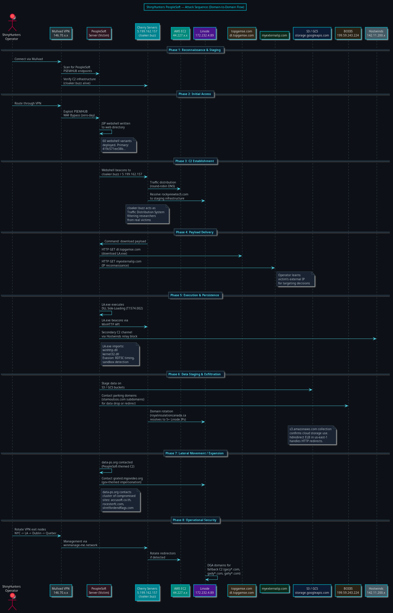

*Figure 9: Reconstructed attack sequence showing the domain-to-domain operational flow from initial PeopleSoft exploitation through C2 establishment, payload delivery, and data staging.*

The attack sequence follows this operational flow:

1. **Reconnaissance:** The operator connects through Mullvad VPN (146.70.x.x exit nodes) and scans for PeopleSoft PSEMHUB endpoints. C2 infrastructure is verified alive via `cloaker.buzz`.

2. **Initial Access:** Through the VPN, the operator exploits the PSEMHUB WAF bypass zero-day. A JSP webshell (one of 60 variants) is written to the PeopleSoft web directory.

3. **C2 Establishment:** The webshell beacons to `5.199.162.157` (Cherry Servers) via `cloaker.buzz`. The cloaker TDS filters incoming connections — serving malicious responses to genuine victims while deflecting researchers. Traffic is distributed through AWS EC2 redirectors (`44.227.x.x`) via round-robin DNS.

4. **Payload Delivery:** The C2 instructs the webshell to download `LA.exe` from `dl.topgamse.com`. Simultaneously, `myexternalip.com` is queried to discover the victim's external IP address for targeting decisions and geolocation-based payload customization.

5. **Execution and Persistence:** `LA.exe` executes using DLL side-loading (T1574.002), loading malicious DLLs alongside a legitimate application. The binary uses WinHTTP API calls to establish persistent HTTP-based C2 communication back to the Cherry Servers infrastructure. Sandbox evasion via RDTSC timing measurements prevents analysis in virtual environments.

6. **Data Staging:** Exfiltrated data is staged through cloud services — AWS S3 buckets and Google Cloud Storage (`storage.googleapis.com`). The `hdredirect` ELB in `us-east-1` handles HTTP redirects for data routing. BODIS parking domains under `stamoutsos.com` serve as data drop or redirect endpoints.

7. **Lateral Movement:** The compromised host contacts `data-ps.org` (PeopleSoft-themed C2) and `grated.mgovideo.org` (government-themed impersonation). A cluster of compromised websites (`accusoft.co.th`, `rocesterfc.com`, `stretfordendflags.com`) serves as relay nodes for distributed C2 communication.

8. **Operational Security:** The operator rotates Mullvad VPN exit nodes across geographic regions (NYC → LA → Dublin → Quebec). Management is performed through `winmanage-me.network`. DGA domains (`gacy*.com`, `gady*.com`, `gahy*.com`) provide fallback C2 channels if primary domains are taken down.

### 10.3 Registrar Diversity Analysis

The campaign demonstrates deliberate registrar diversity to complicate coordinated takedown actions:

| Registrar | Country | Domains | Phase |
|---|---|---|---|
| GoDaddy.com, LLC | US | 8+ | Legacy/Bulk |
| DYNADOT LLC | US | 3+ | DGA + Staging |
| Porkbun LLC | US | 1 | Infrastructure Prep |
| PublicDomainRegistry | India | 1 | Targeting Prep |
| Onamae.com (GMO) | Japan | 1 | Campaign Buildup |
| Spaceship, Inc. | US | 2+ | Active Campaign |
| Media Elite Holdings | UK | 5+ | DGA Registration |
| Namecheap | US | 2+ | Various |
| Name SRS AB | Sweden | 3+ | Pre-Campaign |
| Squarespace Domains | US | 2+ | Bulk/Buildup |

The registrar selection spans US, India, Japan, UK, and Sweden — ensuring no single registrar or jurisdiction can unilaterally disrupt the entire domain infrastructure.

---

## 11. SIDEEYE Backdoor and Payload Capability Analysis

### 11.1 SIDEEYE: The Primary Post-Exploitation Backdoor

SIDEEYE is a custom C++ backdoor deployed by UNC6240/ShinyHunters during their PeopleSoft exploitation campaigns. Delivered through a trojanized installer masquerading as the Light Alloy media player (`Ple64.exe`, 5.2MB), SIDEEYE employs a three-stage execution chain: the signed installer loads a second-stage launcher, which decrypts embedded data to reflectively load the SIDEEYE backdoor directly into memory — avoiding disk-based detection entirely [1][2].

The installer carries a valid Extended Validation (EV) code signing certificate issued to "Tobias Weihmann Software Development OU" via Sectigo, enabling it to bypass Windows SmartScreen, application whitelisting policies, and many static antivirus detections. This level of certificate abuse indicates either a stolen or fraudulently obtained EV certificate — a significant operational investment [2].

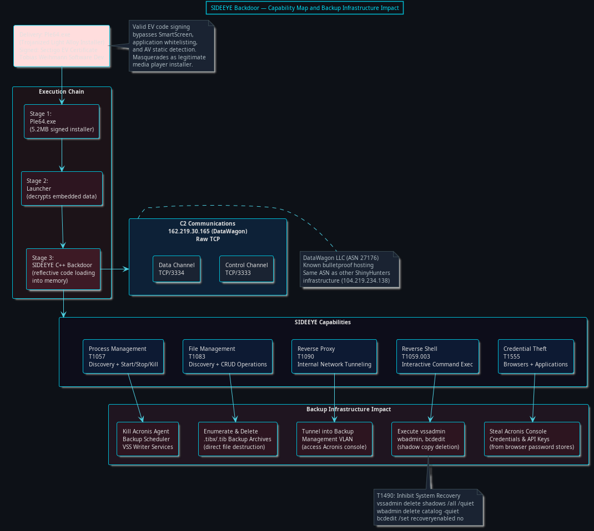

*Figure 10: SIDEEYE backdoor execution chain, C2 architecture, and capability modules mapped to backup infrastructure impact vectors.*

SIDEEYE communicates with its command-and-control server at `162.219.30.165` (DataWagon LLC, ASN 27176 — the same ASN hosting other ShinyHunters infrastructure) over raw TCP using separate control (TCP/3333) and data (TCP/3334) channels. Its capabilities include five primary modules, each with direct implications for backup infrastructure [2]:

| Capability | MITRE Technique | Description |
|---|---|---|
| Credential Theft | T1555 | Steals credentials from web browsers and desktop applications |
| Reverse Shell | T1059.003 | Interactive command-line access for arbitrary command execution |
| Reverse Proxy | T1090 | Tunnels into internal network segments |
| File Management | T1083 | Discovers, creates, modifies, and deletes files and directories |
| Process Management | T1057 | Discovers, starts, stops, and kills processes |

### 11.2 MeshAgent: Legitimate RMM Weaponized for Persistence

Alongside SIDEEYE, ShinyHunters deploys MeshAgent — the client component of MeshCentral, an open-source remote monitoring and management (RMM) platform. The agents masquerade as Microsoft Azure services to reduce detection likelihood [3][4]:

| Filename | SHA-256 | Architecture |
|---|---|---|
| meshagent64-azure-ops.exe | `f02a924c9ff92a8780ce812511341182c6b509d45bc59f3f7b522e37225d24fc` | Windows 64-bit |
| meshagent64-v2.exe | `d83fdb9e53c5ff03c4cb0451ea1bebd79b53f29eadc1e2fa394c7af13a86ce2f` | Windows 64-bit |
| meshagent32-azure-ops.exe | `c7e9332731b06644fc73e0046a2a89eaa59b09f54250e9bd622467187351711f` | Windows 32-bit |
| meshagent | `68257a6f9ff196179ec03624e849927f26599eb180a7c82e14ef5bc4e93bc309` | Linux |

The MeshCentral C2 operates at `wss://azurenetfiles[.]net:443/agent.ashx` — a domain deliberately mimicking Microsoft's Azure NetApp Files service. MeshAgent provides full remote desktop, file transfer, command shell, and script execution capabilities, effectively giving the operator GUI-level access to compromised systems including backup management consoles [4].

### 11.3 LA.exe: DLL Side-Loading Implant

As analyzed from the VirusTotal and Yomi Hunter sandbox reports (Section 1.3), `LA.exe` (SHA-256: `3ba21569...c417c3`) uses DLL side-loading (T1574.002) and imports WinHTTP API functions for HTTP-based C2 communication. Its security software discovery capability (T1518.001) actively enumerates installed security products — including backup agents — to assess the defensive posture of compromised hosts. The system information discovery module (T1082) gathers volume, disk, and partition information relevant to identifying backup storage locations.

### 11.4 Lateral Movement Toolkit

The complete post-exploitation toolkit deployed across the campaign includes [3][4][5]:

- **Neo-reGeorg** — HTTP tunneling toolkit for creating covert channels through web servers, enabling internal network pivoting while appearing as legitimate HTTP traffic
- **fanout.sh** (`[victim_abbreviation]_fanout.sh`) — Custom bash script that parses `/etc/hosts` for hostnames and sprays hardcoded username/password combinations via SSH, automating credential-based lateral movement across PeopleSoft and potentially backup server infrastructure
- **Outbound SMB (TCP/445)** — Triggers outbound SMB connections to attacker-controlled servers, capturing Windows machine-account NetNTLM hashes for offline cracking
- **XMLDecoder Persistence** — Modified XML files in `envmetadata/data/environment/` execute arbitrary code when PeopleSoft restarts, providing persistence that survives application updates

---

## 12. The FBI Breach: FBIjobs.gov and AWS GovCloud Compromise

### 12.1 Attack Narrative

In late September 2026, ShinyHunters claimed to have breached FBI systems using the same PeopleSoft zero-day (CVE-2026-35273) they had been exploiting since May. According to statements made to BleepingComputer and subsequently partially verified by 404 Media, the attackers exploited the PeopleSoft deployment underlying `FBIjobs.gov` (specifically `apply.fbijobs.gov`) to gain initial access, then moved laterally into FBI-managed AWS GovCloud infrastructure [6][7][8].

The breach resulted in the defacement of `apply.fbijobs.gov`, which displayed "THIS SITE HAS BEEN SEIZED BY SHINYHUNTERS" alongside the group's trademark Umbreon Pokémon logo. The FBI confirmed the incident, stating it was "aware of claims regarding unauthorized activity affecting FBIjobs.gov and is currently investigating" [6].

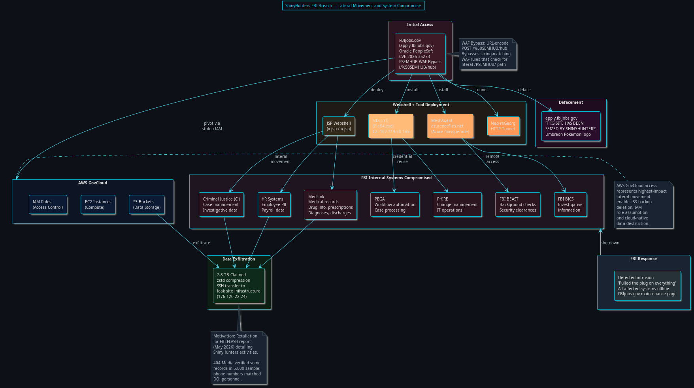

*Figure 12: FBI breach attack chain showing initial PeopleSoft exploitation of FBIjobs.gov, lateral movement into 7+ FBI internal systems, and pivot into AWS GovCloud infrastructure.*

### 12.2 Systems Compromised

ShinyHunters claimed access to at least seven FBI internal systems, representing a comprehensive cross-section of the bureau's operational infrastructure [7][8]:

| System | Function | Data at Risk |
|---|---|---|
| Criminal Justice (CJ) | Case management and investigative data | Case files, investigative records |
| HR Systems | Human resources and payroll | Employee PII, salary data, career histories |
| MedLink | Medical records management | Drug information, prescriptions, diagnoses, discharges |
| PEGA | Workflow automation and case processing | Operational workflows, case assignments |
| PHIRE | Change management and IT operations | IT infrastructure documentation |
| FBI BEAST | Background check processing | Security clearance data, applicant investigations |
| FBI BICS | Investigative information systems | Investigative case data |

### 12.3 Data Exfiltration and Impact

ShinyHunters claimed exfiltration of 2-3 TB of data encompassing FBI agent PII (current and former employees), job applicant data (described as "tens of thousands" of records), medical information, career details including "roles of FBI staff in little-known or sensitive FBI units," and background check data [6][7]. 404 Media independently verified some phone numbers and Department of Justice personnel associations in a 5,000-record sample shared by the attackers [6].

The stated motivation was retaliation for an FBI FLASH report published in May 2026 that detailed ShinyHunters' activities and discouraged ransom payments. ShinyHunters characterized the report as containing "substantial false allegations" and "disinformation," demanding the FBI correct or remove the document within one week [6][7].

### 12.4 AWS GovCloud Lateral Movement

The lateral movement from PeopleSoft into AWS GovCloud represents the highest-impact trajectory identified in this campaign. AWS GovCloud access potentially enabled [7][8]:

- **S3 Bucket Access** (T1530 - Data from Cloud Storage) — Reading, copying, or deleting data stored in government S3 buckets, including potential backup storage
- **IAM Role Assumption** (T1078.004 - Cloud Accounts) — Assuming IAM roles to escalate cloud-side privileges
- **Compute Infrastructure Modification** (T1578.002 - Modify Cloud Compute Infrastructure) — Modifying or destroying cloud compute resources
- **Backup Storage Destruction** — If FBI backup infrastructure utilized S3-compatible storage (Acronis Cloud or native AWS Backup), compromised IAM credentials could enable deletion of cloud-hosted backup archives

---

## 13. Acronis and Backup Infrastructure: Convergent Threat Assessment

### 13.1 CVE-2026-87886: Acronis Backup Plugin Privilege Escalation

Concurrent with the ShinyHunters FBI breach, a separate but analytically significant vulnerability was actively exploited in the wild: CVE-2026-87886, a local privilege escalation flaw in Acronis Backup plugins for cPanel & WHM and Plesk hosting panels. Classified as CWE-276 (Incorrect Default Permissions) with a CVSS score of 7.8, this vulnerability allows an authenticated attacker with low-privileged local access to escalate to root-level system access through insecure default file permissions [9].

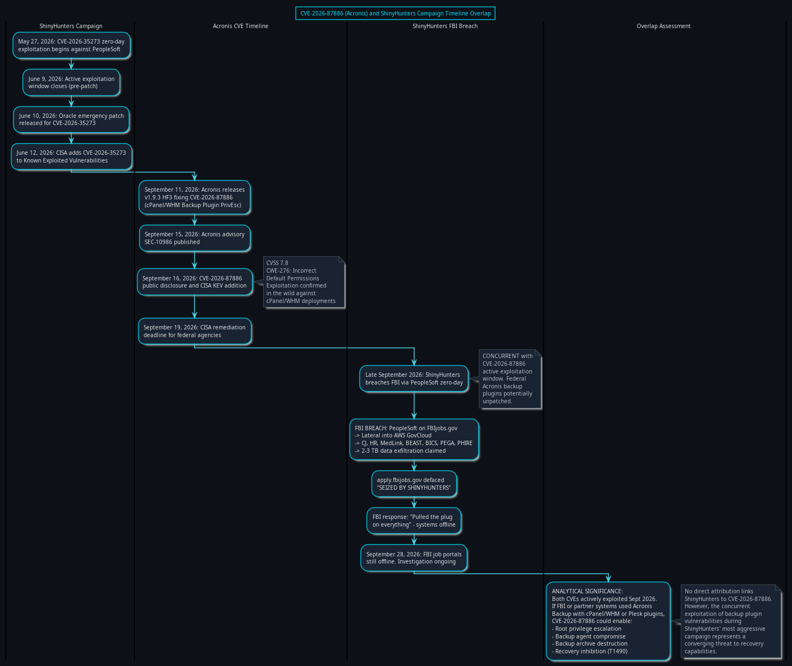

*Figure 13: Timeline overlap between ShinyHunters campaign milestones and CVE-2026-87886 (Acronis Backup plugin privilege escalation) active exploitation window.*

The timeline convergence is striking [9]:

| Date | Event |
|---|---|
| September 11, 2026 | Acronis releases v1.9.3 HF3 patching CVE-2026-87886 |
| September 15, 2026 | Acronis advisory SEC-10986 published |
| September 16, 2026 | CVE-2026-87886 added to CISA Known Exploited Vulnerabilities |
| September 19, 2026 | CISA remediation deadline for federal agencies |
| Late September 2026 | ShinyHunters breaches FBI via PeopleSoft zero-day |
| September 28, 2026 | FBI job portals remain offline |

While no direct attribution links ShinyHunters to CVE-2026-87886 exploitation, the concurrent targeting of backup infrastructure during the same operational window — combined with the CISA KEV addition confirming active exploitation in the wild — creates a compounding risk scenario: organizations compromised via PeopleSoft that also ran vulnerable Acronis plugins faced simultaneous attack vectors against both their application layer and their recovery infrastructure.

### 13.2 How ShinyHunters' Toolkit Enables Backup Destruction

The SIDEEYE backdoor, MeshAgent, and webshell capabilities combine to create a comprehensive backup destruction capability even without exploiting Acronis-specific vulnerabilities. Each SIDEEYE module maps directly to a backup infrastructure attack vector:

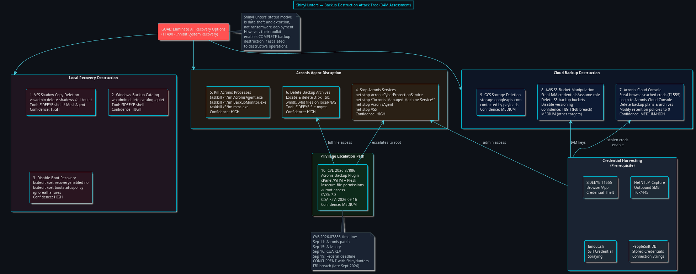

*Figure 11: D4M (Damage for Motivation) assessment showing nine backup destruction vectors enabled by ShinyHunters' toolkit, with confidence ratings.*

**Local Recovery Destruction (HIGH confidence):**

SIDEEYE's interactive reverse shell enables direct execution of Windows system recovery inhibition commands. These are standard pre-ransomware deployment techniques that ShinyHunters' toolkit supports natively:

```
vssadmin delete shadows /all /quiet          # Delete all Volume Shadow Copies
wbadmin delete catalog -quiet                 # Delete Windows Backup catalog
bcdedit /set {default} recoveryenabled no     # Disable Windows Recovery Environment
bcdedit /set {default} bootstatuspolicy ignoreallfailures
```

**Acronis Agent Disruption (HIGH confidence):**

SIDEEYE's process management module can enumerate and terminate Acronis-specific services and processes:

```
net stop AcronisCyberProtectionService        # Stop Acronis Cyber Protect agent
net stop "Acronis Managed Machine Service"    # Stop management service
net stop AcronisAgent                         # Stop backup agent
net stop VSS                                  # Stop Volume Shadow Copy Service
taskkill /f /im AcronisAgent.exe              # Force-kill agent process
taskkill /f /im BackupMonitor.exe             # Kill backup monitor
```

Once Acronis services are stopped, the file management module can locate and delete `.tibx`, `.tib`, `.vmdk`, and `.vhd` backup archives from local and network-attached storage.

**Cloud Backup Destruction (MEDIUM-HIGH confidence):**

SIDEEYE's credential theft module (T1555) extracts saved passwords from web browsers and desktop applications. If administrators have accessed the Acronis Cloud Console via a browser on a compromised host, those credentials become available for:

1. **Authenticating to Acronis Cloud Console** to delete backup plans, archives, and retention policies
2. **Stealing API keys** for programmatic backup deletion via Acronis Cyber Protect Cloud API
3. **Modifying retention policies** to zero days, causing automatic cleanup deletion of all stored backups

For AWS-integrated environments (as confirmed in the FBI breach), stolen IAM credentials enable direct S3 bucket manipulation — deleting backup objects, disabling versioning, and removing lifecycle policies that protect against accidental deletion.

### 13.3 Backup Copy Exfiltration

Beyond destruction, backup archives themselves represent high-value exfiltration targets. A single Acronis `.tibx` full system backup can contain:

- Complete system images with all installed software and configurations
- Database dumps with years of historical records
- Stored credentials, certificates, and private keys
- Email archives and document stores
- Configuration files containing connection strings and API keys

ShinyHunters' confirmed use of `zstd` compression for data exfiltration [4] and the deployment of Python SimpleHTTP servers on port 8888 for staging [4] provide the infrastructure for large-scale backup file exfiltration. The 2-3 TB data volumes claimed in the FBI breach are consistent with backup archive exfiltration rather than real-time database queries alone.

### 13.4 D4M Confidence Summary

| Vector | Confidence | Rationale |
|---|---|---|
| VSS Shadow Copy Deletion | HIGH | SIDEEYE shell access + standard technique |
| Windows Backup Catalog Deletion | HIGH | Standard post-exploitation command |
| Boot Recovery Disable | HIGH | Standard pre-encryption step |
| Acronis Agent Service Termination | HIGH | SIDEEYE process management confirmed |
| Backup Archive File Deletion | HIGH | SIDEEYE file management confirmed |
| Acronis Cloud Console Credential Theft | HIGH | SIDEEYE T1555 credential theft confirmed |
| Cloud Backup Deletion via API | MEDIUM | Requires cached browser credentials |
| CVE-2026-87886 Acronis PrivEsc | MEDIUM | Timeline overlap, no direct attribution |
| AWS S3 Backup Bucket Manipulation | HIGH (FBI) / MEDIUM (other) | AWS GovCloud access confirmed for FBI |

---

## 14. Synthesis: From Initial Access to Total Recovery Inhibition

### 14.1 The Complete Attack Path

The ShinyHunters campaign demonstrates a systematic approach that, when fully executed, can progress from initial web application compromise to complete elimination of an organization's recovery capability:

1. **Initial Access** → CVE-2026-35273 provides unauthenticated RCE on internet-facing PeopleSoft servers
2. **Persistence** → JSP webshells + XMLDecoder persistence survive application restarts and patching
3. **Tool Deployment** → SIDEEYE (credential theft, shell, proxy, file/process management) + MeshAgent (remote GUI access) + Neo-reGeorg (tunneling)
4. **Credential Harvesting** → Browser credentials, NetNTLM hashes, SSH credential spraying, database connection strings
5. **Lateral Movement** → SSH to internal hosts, MeshCentral remote access, AWS/cloud pivot
6. **Backup Reconnaissance** → SIDEEYE T1518.001 discovers installed backup agents; T1082 enumerates volumes and backup storage
7. **Backup Destruction** → Service termination, shadow copy deletion, backup archive deletion, cloud console access via stolen credentials
8. **Data Exfiltration** → 2-3 TB via zstd compression and SSH/SimpleHTTP staging
9. **Extortion/Impact** → Data release threats, defacement, reputational damage

### 14.2 Defensive Recommendations for Backup Infrastructure

1. **Isolate Backup Management Networks** — Acronis management consoles and backup storage should be on segmented VLANs inaccessible from PeopleSoft or general-purpose application servers
2. **MFA for Backup Console Access** — Require multi-factor authentication for all Acronis Cloud Console, S3 bucket, and backup management access to prevent credential reuse attacks
3. **Immutable Backups** — Enable Acronis immutable storage, S3 Object Lock, or equivalent write-once policies that prevent deletion even with valid credentials
4. **Patch CVE-2026-87886** — Update Acronis Backup plugins for cPanel/WHM to 1.9.3.1021+ and Plesk to 1.8.11.638+ per CISA directive
5. **Monitor for T1490 Indicators** — Alert on `vssadmin`, `wbadmin`, and `bcdedit` command execution, Acronis service stops, and bulk `.tibx`/`.tib` file deletions
6. **Air-Gapped Backup Copies** — Maintain at least one backup copy that is physically disconnected and inaccessible from the network

---

## References

[1] Mallory.ai, "SIDEEYE Malware Analysis," 2026. [https://mallory.ai/malware/01a0db4c-9c01-79a4-9f47-d4c5b13b51b5](https://mallory.ai/malware/01a0db4c-9c01-79a4-9f47-d4c5b13b51b5)

[2] SOCPrime, "ShinyHunters Exploits Oracle PeopleSoft in Education," 2026. [https://socprime.com/active-threats/shinyhunters-targets-education-sector-with-oracle-peoplesoft-exploit/](https://socprime.com/active-threats/shinyhunters-targets-education-sector-with-oracle-peoplesoft-exploit/)

[3] The Hacker News, "ShinyHunters Exploits Oracle PeopleSoft Zero-Day (CVE-2026-35273) to Breach Universities," June 2026. [https://thehackernews.com/2026/06/shinyhunters-exploits-oracle-peoplesoft.html](https://thehackernews.com/2026/06/shinyhunters-exploits-oracle-peoplesoft.html)

[4] Rapid7, "Active Exploitation of Oracle PeopleSoft Zero-Day (CVE-2026-35273)," June 2026. [https://www.rapid7.com/blog/post/etr-active-exploitation-of-oracle-peoplesoft-zero-day-cve-2026-35273/](https://www.rapid7.com/blog/post/etr-active-exploitation-of-oracle-peoplesoft-zero-day-cve-2026-35273/)

[5] SecurityWeek, "Google Confirms Exploitation of Oracle PeopleSoft Zero-Day by ShinyHunters," June 2026. [https://www.securityweek.com/google-confirms-exploitation-of-oracle-peoplesoft-zero-day-by-shinyhunters/](https://www.securityweek.com/google-confirms-exploitation-of-oracle-peoplesoft-zero-day-by-shinyhunters/)

[6] BleepingComputer, "ShinyHunters claims FBI hack, data theft in PeopleSoft zero-day breach," September 2026. [https://www.bleepingcomputer.com/news/security/shinyhunters-claims-fbi-hack-data-theft-in-peoplesoft-zero-day-breach/](https://www.bleepingcomputer.com/news/security/shinyhunters-claims-fbi-hack-data-theft-in-peoplesoft-zero-day-breach/)

[7] The Hacker News, "ShinyHunters Claims FBI Breach, Says It Stole Data on Agents and Job Applicants," September 2026. [https://thehackernews.com/2026/09/shinyhunters-claims-fbi-breach-says-it.html](https://thehackernews.com/2026/09/shinyhunters-claims-fbi-breach-says-it.html)

[8] Help Net Security, "FBI job portals remain offline after ShinyHunters claims breach via PeopleSoft zero-day," September 28, 2026. [https://www.helpnetsecurity.com/2026/09/28/fbi-job-portals-offline-shinyhunters-breach/](https://www.helpnetsecurity.com/2026/09/28/fbi-job-portals-offline-shinyhunters-breach/)

[9] SOCPrime, "CVE-2026-87886: Acronis Backup Plugin Flaw Exploited," September 2026. [https://socprime.com/blog/cve-2026-87886-acronis-backu-plugin-flaw-exploited/](https://socprime.com/blog/cve-2026-87886-acronis-backu-plugin-flaw-exploited/)

[10] Aviatrix, "ShinyHunters Oracle PeopleSoft CVE-2026-35273 WAF Bypass Attack Analysis," 2026. [https://aviatrix.ai/threat-research-center/shinyhunters-oracle-peoplesoft-cve-2026-35273-waf-bypass/](https://aviatrix.ai/threat-research-center/shinyhunters-oracle-peoplesoft-cve-2026-35273-waf-bypass/)

[11] Google Cloud Blog / Mandiant, "ShinyHunters Renewed Mass Exploitation Campaign Targeting Oracle PeopleSoft," 2026. [https://cloud.google.com/blog/topics/threat-intelligence/shinyhunters-renewed-mass-exploitation-campaign-targeting-oracle-peoplesoft](https://cloud.google.com/blog/topics/threat-intelligence/shinyhunters-renewed-mass-exploitation-campaign-targeting-oracle-peoplesoft)

[12] CyberInsider, "ShinyHunters claims FBI breach," September 2026. [https://cyberinsider.com/shinyhunters-claims-fbi-breach/](https://cyberinsider.com/shinyhunters-claims-fbi-breach/)

[13] Push Security, "How three techniques are behind ShinyHunters' 2026 campaigns," 2026. [https://pushsecurity.com/blog/analyzing-the-instructure-breach](https://pushsecurity.com/blog/analyzing-the-instructure-breach)

[14] Acronis, "Cyberthreats Update, August 2026," 2026. [https://www.acronis.com/en/tru/posts/acronis-cyberthreats-update-august-2026/](https://www.acronis.com/en/tru/posts/acronis-cyberthreats-update-august-2026/)

[15] MITRE ATT&CK, "T1490 — Inhibit System Recovery." [https://attack.mitre.org/techniques/T1490/](https://attack.mitre.org/techniques/T1490/)

---

## Appendix A: Methodology

All analysis was performed using the following data sources and tools:

- **VirusTotal Graph Exports**: `Shiny_Hunters_PeopleSoftZeroDay.json` (1,805 nodes, 2,186 links), `EntireGraph.json` (458 nodes, 497 links)
- **JSP Webshell Identifiers**: `jspWebShellIdentifiers.json` (60 SHA-256 hashes)
- **Domain Indicators**: `subset.csv` (20 domains)
- **Sandbox Reports**: Yomi Hunter analysis of LA.exe, VirusTotal behavioral analysis
- **WHOIS/RDAP**: IPWhois library for IP RDAP queries, python-whois for domain WHOIS
- **DNS**: dnspython for reverse DNS lookups, socket library fallback
- **Analysis Scripts**: All reproducible scripts saved in `scripts/` directory

Reproducibility scripts:
- `scripts/01_extract_graph_data.py` — Extracts and structures all graph data
- `scripts/02_whois_rdns_analysis.py` — Performs WHOIS, RDAP, and rDNS enrichment
- `scripts/03_infrastructure_mapper.py` — Maps infrastructure tiers and pivot domains
- `scripts/04_domain_timeline_analysis.py` — Domain registration timeline and phase classification
- `scripts/05_payload_capability_analysis.py` — SIDEEYE, LA.exe, MeshAgent, and D4M assessment

## Appendix B: Diagram Index

| Figure | File | Description |
|---|---|---|
| 1 | `docs/diagrams/04_webshell_to_payload.png` | JSP webshell to payload delivery chain |
| 2 | `docs/diagrams/01_attack_chain_overview.png` | High-level attack chain overview |
| 3 | `docs/diagrams/02_infrastructure_resolution.png` | DNS resolution chains |
| 4 | `docs/diagrams/03_vpn_anonymization_layer.png` | VPN and anonymization infrastructure |
| 5 | `docs/diagrams/05_dga_domain_patterns.png` | DGA domain patterns |
| 6 | `docs/diagrams/06_provider_infrastructure_map.png` | Complete provider infrastructure map |
| 7 | `docs/diagrams/07_government_cloud_attack_path.png` | Government-themed domains and cloud abuse |
| 8 | `docs/diagrams/08_campaign_timeline.png` | Campaign lifecycle timeline |
| 9 | `docs/diagrams/09_attack_sequence_flow.png` | Attack sequence domain-to-domain flow |
| 10 | `docs/diagrams/10_sideeye_capability_map.png` | SIDEEYE backdoor capability map |
| 11 | `docs/diagrams/11_backup_destruction_attack_tree.png` | D4M backup destruction attack tree |
| 12 | `docs/diagrams/12_fbi_breach_lateral_movement.png` | FBI breach lateral movement chain |
| 13 | `docs/diagrams/13_acronis_cve_timeline_overlap.png` | CVE-2026-87886 timeline overlap |
